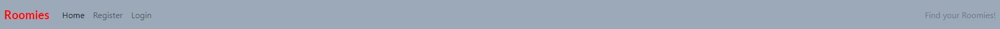
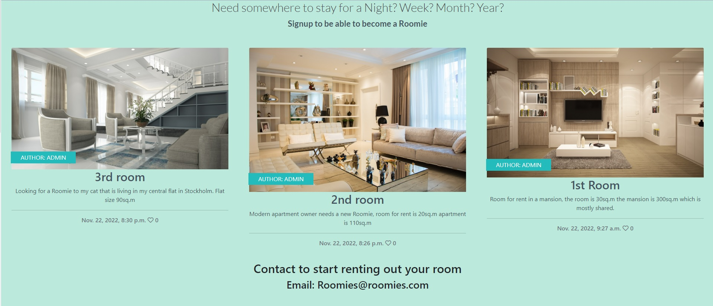
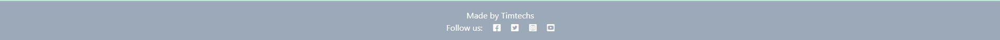
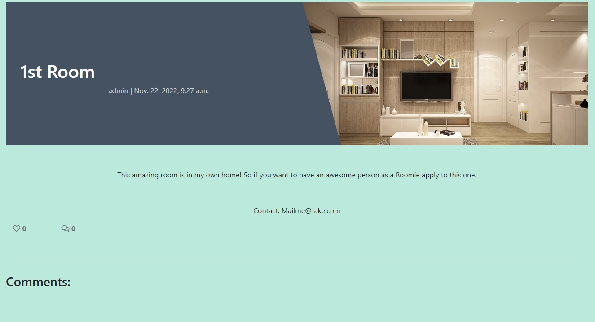

# Roomies

Welcome to Roomies, a page to rent out your spare room for extra money. This webpage is for the user who wants to earn some extra money or just help those in need. This page is mostly in Stockholm but in the future it will expand all over the globe.

## Features

### Existing Features

- __Navigation bar__

    - Featured on all pages is a navigation bar that have links to the homepage, register page, and login page. When you are logged in it changes to logout
    - Room details so you can see abit more information on the rooms and also comment/like the rooms
    - The comment and like features is great for users to find a room more fitting their needs

- __The landing page__

    - The landing page is the latest rooms that where added so you can find the most relevant rooms in a blog style manner
    - This will help the user find what they need in an intresting way

- __Footer__

    - The footer is loaded with social media links

- __Room Details__

    - The user can look at each rooms details to find more information about the rooms
    - The user can also find the comments for the rooms on this page

### Features left to implement

- area filter
- price range
- rating system

## Testing

- This page is tested on [amiresponsive](https://ui.dev/amiresponsive?url=https://8000-timtechs-ciproject4-t2n93wrrs0e.ws-eu86.gitpod.io/1st-room/)
